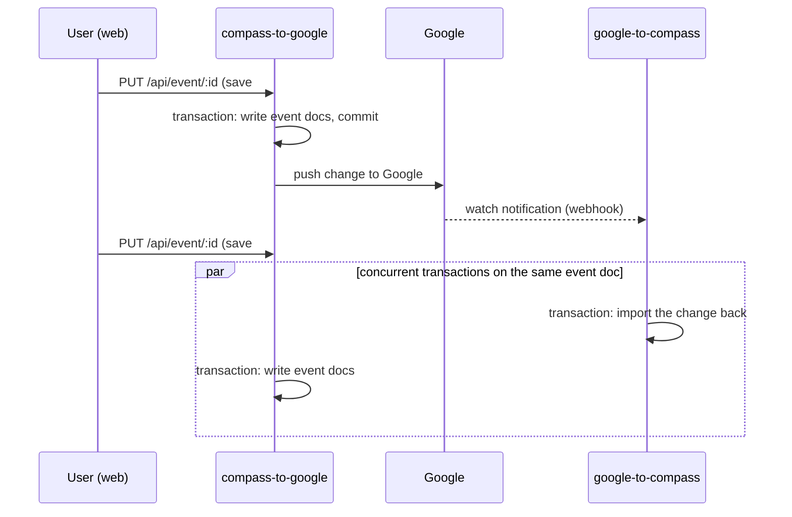

# Event Propagation Transactions And Write Conflicts

How the two event-propagation paths use MongoDB transactions, why concurrent
writes conflict by design, and the invariants that keep those conflicts
invisible to users. Read this before touching either propagation service or
adding a new calendar integration.

For the surrounding flows (routes, SSE, watch lifecycle), see
[Google Sync And SSE Flow](../features/google-sync-and-sse-flow.md).

## The Two Transactional Paths

Every event write in Compass funnels through one of two services, and each one
wraps its Mongo writes in a multi-document transaction:

| Path | Trigger | Source |
| --- | --- | --- |
| Compass → provider | User CRUD via `EventController` | `packages/backend/src/sync/services/event-propagation/compass-to-google/compass-to-google.event-propagation.ts` |
| Provider → Compass | Google watch notification (webhook) | `packages/backend/src/sync/services/event-propagation/google-to-compass/google-to-compass.event-propagation.ts` |

Transactions are required because a single logical change can touch many
documents (a recurring series edit rewrites the base plus instances), and a
partial write would corrupt the series.

## Why These Paths Race Each Other

The two paths are causally linked, so the race is not an edge case — the
system creates it on every save:

When two transactions touch the same document, WiredTiger aborts the loser
with `WriteConflict` (code 112) labeled `TransientTransactionError`. That
label is MongoDB's contract: the operation is safe to retry, and the caller
is expected to. Rapid saves to one event (undo/redo replay, drag bursts) make
this collision routine, because each save spawns a webhook import that lands
while the next save is in flight.

The web client serializes its own writes per event
(`waitForPrecedingEventWrites` in
`packages/web/src/events/mutations/event.mutation.runtime.ts`), but it can
only order requests it sends. Webhook imports are server-to-server; only the
backend can resolve that race.

## The Invariants

Both services follow the same shape. Keep these invariants when editing them,
and copy them when building a new integration:

1. **Wrap the transaction in `session.withTransaction()`.** The driver
   re-runs the callback on `TransientTransactionError`, so losing a write
   conflict costs a retry instead of a 500. Never hand-roll
   `startTransaction`/`commitTransaction` without a retry loop — that was the
   original bug.
2. **No provider I/O inside the transaction.** The transaction callback must
   contain only Mongo work. External calls inside it break both halves of the
   design: they hold document locks across a network round-trip (widening the
   conflict window from milliseconds to hundreds of milliseconds), and they
   re-execute on retry (duplicate provider calls).
3. **Collect provider effects during the transaction, execute after commit.**
   `compass-to-google` applies the Mongo plan inside the callback, returns the
   list of applied changes, and only then runs the Google create/update/delete
   calls. A retried transaction therefore never repeats a provider call.
4. **Notify clients (SSE) after provider effects.** Client refetches should
   observe committed state.
5. **End the session in `finally`.** Sessions are pooled server resources.

The regression test for invariant 3 lives in
`packages/backend/src/sync/services/event-propagation/__tests__/compass-to-google.event-propagation.test.ts`
("runs Google effects once even when the transaction retries") — it replays
the transaction callback twice, the way the driver does after a conflict, and
asserts the provider call fired exactly once.

## Consequences Worth Knowing

- **Compass commits before the provider hears about it.** If the provider
  call fails after commit, Compass keeps the change and the error surfaces to
  the caller. This matches the optimistic client (which already applied the
  change) better than the old rollback behavior did, but it means a provider
  failure leaves the provider one change behind until the next successful
  push or import.
- **A missing Google refresh token is not an error.** Provider effects are
  skipped for users who never connected (or revoked) Google — Compass-local
  writes still succeed.
- **Imports are idempotent, so retrying them is safe.** Two overlapping
  webhook imports for the same change upsert the same documents; whichever
  retries converges to the same state.

## Adding A New Integration

A future provider (Outlook, CalDAV, …) gets its own pair of propagation
services mirroring this structure:

- outbound: plan and apply Compass writes inside `withTransaction`, return the
  applied changes, run provider effects after commit
- inbound: translate provider changes to Compass upserts, all inside
  `withTransaction`, with no provider I/O in the callback (fetch the changes
  *before* opening the transaction, the way `GCalNotificationHandler` does)

The write-conflict race described above exists between **any** two paths that
write event documents — including two different providers syncing the same
user. The invariants are what make that safe; they are not Google-specific.
