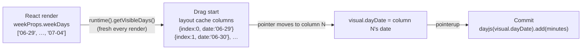
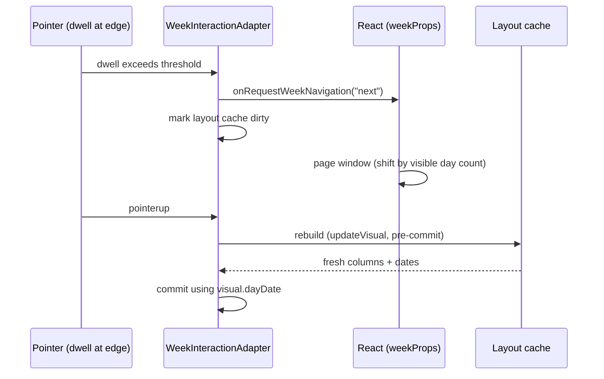

# Week Drag Interaction

How dragging a saved event on the calendar grid resolves the day it lands on.

## The one-sentence model

**A drag column knows its own date.** The layout cache built at drag start
carries `{ index, left, width, date }` for every rendered day column, sourced
from the same React render that painted them — so drag geometry and drop
dates can never disagree with what is on screen, even mid-gesture.

## Why this exists

The week view renders a *window* of 1–7 day columns (not always the full
week — see [Responsive Layout](./responsive-layout.md)).
Column **index** is window-relative (`0..N-1`), but earlier code seeded a
drag's starting day from `event.startDate.getDay()` — a week-absolute value
(`0=Sun..6=Sat`). The two only agreed when 7 columns rendered starting
Sunday. Once the window could shrink or start mid-week, the mismatch caused:

- drags that "stuck" partway across the grid (the wrong reference column
  corrupted the pointer-delta math)
- drops landing on the wrong day
- both getting worse after a mid-drag edge navigation, which used to bump a
  `weekOffsetDays` counter by a hardcoded `±7` — wrong whenever paging shifts
  by something other than a full week

## How it works now

Files:

- `packages/web/src/layout/calendar-grid/interaction/calendarLayoutCache.ts` —
  `buildCalendarDayColumns` stamps each column with its date.
- `packages/web/src/views/Week/interaction/adapter/geometry/weekLayoutCache.ts` —
  builds the week's timed/all-day caches from `visibleDays: string[]`.
- `packages/web/src/views/Week/interaction/WeekInteractionCoordinator.tsx` /
  `SomedayInteractionCoordinator.tsx` — supply `getVisibleDays()` on the
  runtime from `weekProps.component.weekDays`.
- `packages/web/src/layout/calendar-grid/interaction/model/TimedDragVisual.ts`,
  `AllDayDragVisual.ts` — visuals track `dayDate` / `initialDayDate` instead of
  a day-index-plus-offset pair.

Commit math differs by event type:

- **Timed** events assign the target day *absolutely*:
  `dayjs(visual.dayDate).startOf("day")` — safe because a timed event always
  renders in the column matching its own start date.
- **All-day** events use a *date-diff delta*:
  `dayjs(dayDate).diff(dayjs(initialDayDate), "day")` — required because
  multi-day spans are clamped to the visible window, so the initial column's
  date is the clamped visible edge, not necessarily the event's real start.

## Mid-drag week navigation

Dragging into the edge zone triggers `onRequestWeekNavigation`, which pages
the React window (by the visible day count, not always 7). No day-count
bookkeeping happens in the adapter — it only marks the layout cache dirty.
The pointer-engine already re-runs `updateVisual` (which rebuilds the cache)
immediately before `commit` on pointerup, so the drop always resolves against
the *freshest* rendered columns, whatever the navigation shifted.

## updateVisual Must Be Idempotent

`CalendarInteractionEngine.handlePointerUp`
(`packages/web/src/interaction/CalendarInteractionEngine.ts`)
recomputes the visual by calling `adapter.updateVisual` with the release
pointer, then commits *that* result — it does not commit whatever the last
`requestAnimationFrame` produced. In effect, `updateVisual` runs once during
the final RAF frame and once more at pointerup, fed the first call's own
`visual` output as its input for the second call. So for a fixed release
pointer, feeding a math function's own output back into itself must produce
the same result again — the function must be idempotent under repeated
application with an unchanged pointer.

Any flip/branch logic inside an `updateVisual` math function must branch on
an **immutable** field captured at grab time (e.g. `initialEdge` in
`packages/web/src/layout/calendar-grid/interaction/math/timedResize.ts` and
`allDayResize.ts`) — never on a field the function itself overwrites (e.g. a
mutated `activeEdge`). Branching on a mutated field diverges on the second
pass: the first call flips the edge and updates the field, so the second call
sees the *new* value and can flip again or compute a different result,
producing a wrong committed range specifically on edge-flip drags.

## Pitfall

Do not reintroduce a day-index-only visual (no `date` field) for any new drag
interaction on the week grid — window-relative indices are only meaningful
alongside the column dates they were built from in the same render.
