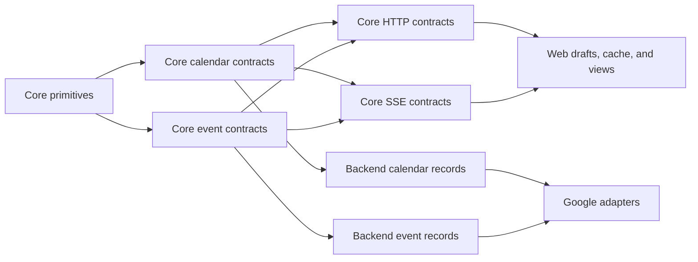

# 01a — Proposed contract schemas

This document expands `01-domain-contracts.md` into concrete Zod and TypeScript
definitions. It is an implementation reference, not committed application
code. When implementation begins, preserve these names and invariants unless a
dated decision in `master-doc.md` records why they changed.

The examples use Zod v4, concrete imports, and no barrel files. Types inferred
from Zod are shown once and reused; interfaces are reserved for web-only state
that never crosses a trust boundary.

## Dependency direction



Core knows nothing about MongoDB, Google SDK objects, React, forms, layout, or
IndexedDB. Backend records depend on core semantics. Web types compose core
read models instead of extending them with optional properties.

## `packages/core/src/types/domain-primitives.ts`

```ts
import { z } from "zod/v4";
import { Priorities } from "@core/constants/core.constants";
import {
  RGBHexSchema,
  TimezoneSchema,
  zYearMonthDayString,
} from "@core/types/type.utils";

const OBJECT_ID_PATTERN = /^[0-9a-f]{24}$/i;

export const EventIdSchema = z
  .string()
  .regex(OBJECT_ID_PATTERN)
  .brand<"EventId">();
export type EventId = z.infer<typeof EventIdSchema>;

export const CalendarIdSchema = z
  .string()
  .regex(OBJECT_ID_PATTERN)
  .brand<"CalendarId">();
export type CalendarId = z.infer<typeof CalendarIdSchema>;

export const DateOnlySchema = zYearMonthDayString.brand<"DateOnly">();
export type DateOnly = z.infer<typeof DateOnlySchema>;

export const DateTimeSchema = z
  .string()
  .datetime({ offset: true })
  .brand<"DateTime">();
export type DateTime = z.infer<typeof DateTimeSchema>;

export const TimeZoneSchema = TimezoneSchema.brand<"TimeZone">();
export type TimeZone = z.infer<typeof TimeZoneSchema>;

export const HexColorSchema = RGBHexSchema;
export type HexColor = z.infer<typeof HexColorSchema>;

export const SortOrderSchema = z.number().int().nonnegative().finite();
export type SortOrder = z.infer<typeof SortOrderSchema>;

export const PrioritySchema = z.enum(Priorities);
export type Priority = z.infer<typeof PrioritySchema>;

export const RRuleSchema = z.array(z.string().trim().min(1)).min(1).readonly();
export type RRule = z.infer<typeof RRuleSchema>;
```

`zYearMonthDayString`, `TimezoneSchema`, and `RGBHexSchema` already exist (all
on `zod/v4`, so they compose directly). Keep one validator for each invariant
rather than introducing near-duplicates. The id split is deliberate:
`EventIdSchema`/`CalendarIdSchema` are branded strings for HTTP/web
boundaries, while records use the existing `zObjectId` sentinel, which parses
to a BSON `ObjectId` and is the only form `zod-to-mongo-schema.ts` maps to
`bsonType: "objectId"`.

## `packages/core/src/types/calendar.contracts.ts`

```ts
import { z } from "zod/v4";
import {
  CalendarIdSchema,
  HexColorSchema,
  TimeZoneSchema,
} from "@core/types/domain-primitives";

export const CalendarProviderSchema = z.enum(["local", "google"]);
export type CalendarProvider = z.infer<typeof CalendarProviderSchema>;

export const CalendarAccessSchema = z.enum([
  "owner",
  "writer",
  "reader",
  "freeBusyReader",
]);
export type CalendarAccess = z.infer<typeof CalendarAccessSchema>;

export const CalendarCapabilitiesSchema = z.strictObject({
  canReadAvailability: z.boolean(),
  canReadDetails: z.boolean(),
  canWrite: z.boolean(),
  canManage: z.boolean(),
  canWatchEvents: z.boolean(),
});
export type CalendarCapabilities = z.infer<typeof CalendarCapabilitiesSchema>;

export const CalendarSchema = z.strictObject({
  id: CalendarIdSchema,
  name: z.string(),
  description: z.string(),
  timeZone: TimeZoneSchema.nullable(),
  foregroundColor: HexColorSchema,
  backgroundColor: HexColorSchema,
  provider: CalendarProviderSchema,
  access: CalendarAccessSchema,
  capabilities: CalendarCapabilitiesSchema,
  isPrimary: z.boolean(),
  isVisible: z.boolean(),
  isActive: z.boolean(),
});
export type Calendar = z.infer<typeof CalendarSchema>;

export const CalendarListResponseSchema = z.strictObject({
  calendars: z.array(CalendarSchema),
});
export type CalendarListResponse = z.infer<typeof CalendarListResponseSchema>;

export const SetCalendarVisibilityInputSchema = z
  .array(
    z.strictObject({
      calendarId: CalendarIdSchema,
      isVisible: z.boolean(),
    }),
  )
  .nonempty();
export type SetCalendarVisibilityInput = z.infer<
  typeof SetCalendarVisibilityInputSchema
>;
```

The bulk array matches the existing `PUT /api/calendars/select` body and lets
plan `08` coalesce rapid toggles into one request; a single toggle is a
one-element array.

The capability mapper is the only place that interprets access roles:

```ts
import {
  type CalendarAccess,
  type CalendarCapabilities,
} from "@core/types/calendar.contracts";

const CAPABILITIES_BY_ACCESS = {
  owner: {
    canReadAvailability: true,
    canReadDetails: true,
    canWrite: true,
    canManage: true,
    canWatchEvents: true,
  },
  writer: {
    canReadAvailability: true,
    canReadDetails: true,
    canWrite: true,
    canManage: false,
    canWatchEvents: true,
  },
  reader: {
    canReadAvailability: true,
    canReadDetails: true,
    canWrite: false,
    canManage: false,
    canWatchEvents: true,
  },
  freeBusyReader: {
    canReadAvailability: true,
    canReadDetails: false,
    canWrite: false,
    canManage: false,
    canWatchEvents: false,
  },
} as const satisfies Record<CalendarAccess, CalendarCapabilities>;

export const getCalendarCapabilities = (
  access: CalendarAccess,
): CalendarCapabilities => CAPABILITIES_BY_ACCESS[access];
```

## `packages/core/src/types/event.contracts.ts`

```ts
import { z } from "zod/v4";
import {
  CalendarIdSchema,
  DateOnlySchema,
  DateTimeSchema,
  EventIdSchema,
  PrioritySchema,
  RRuleSchema,
  SortOrderSchema,
  TimeZoneSchema,
} from "@core/types/domain-primitives";

export const EventContentSchema = z.discriminatedUnion("kind", [
  z.strictObject({
    kind: z.literal("details"),
    title: z.string(),
    description: z.string(),
  }),
  z.strictObject({ kind: z.literal("busy") }),
]);
export type EventContent = z.infer<typeof EventContentSchema>;

const TimedScheduleSchema = z
  .strictObject({
    kind: z.literal("timed"),
    start: DateTimeSchema,
    end: DateTimeSchema,
    timeZone: TimeZoneSchema,
  })
  .refine(({ start, end }) => Date.parse(end) > Date.parse(start), {
    message: "Timed event end must be after start",
    path: ["end"],
  });

const AllDayScheduleSchema = z
  .strictObject({
    kind: z.literal("allDay"),
    start: DateOnlySchema,
    end: DateOnlySchema,
  })
  .refine(({ start, end }) => end > start, {
    message: "All-day event end is exclusive and must be after start",
    path: ["end"],
  });

export const SomedayScheduleSchema = z.strictObject({
  kind: z.literal("someday"),
  period: z.enum(["week", "month"]),
  anchorDate: DateOnlySchema,
  sortOrder: SortOrderSchema,
});
export type SomedaySchedule = z.infer<typeof SomedayScheduleSchema>;

export const ScheduledScheduleSchema = z.discriminatedUnion("kind", [
  TimedScheduleSchema,
  AllDayScheduleSchema,
]);
export type ScheduledSchedule = z.infer<typeof ScheduledScheduleSchema>;

export const EventScheduleSchema = z.discriminatedUnion("kind", [
  TimedScheduleSchema,
  AllDayScheduleSchema,
  SomedayScheduleSchema,
]);
export type EventSchedule = z.infer<typeof EventScheduleSchema>;

const SingleRecurrenceSchema = z.strictObject({
  kind: z.literal("single"),
});

const SeriesRecurrenceSchema = z.strictObject({
  kind: z.literal("series"),
  rules: RRuleSchema,
});

const OccurrenceRecurrenceSchema = z.strictObject({
  kind: z.literal("occurrence"),
  seriesId: EventIdSchema,
});

export const EditableRecurrenceSchema = z.discriminatedUnion("kind", [
  SingleRecurrenceSchema,
  SeriesRecurrenceSchema,
]);
export type EditableRecurrence = z.infer<typeof EditableRecurrenceSchema>;

export const EventRecurrenceSchema = z.discriminatedUnion("kind", [
  SingleRecurrenceSchema,
  SeriesRecurrenceSchema,
  OccurrenceRecurrenceSchema,
]);
export type EventRecurrence = z.infer<typeof EventRecurrenceSchema>;

export const EventSchema = z.strictObject({
  id: EventIdSchema,
  calendarId: CalendarIdSchema,
  content: EventContentSchema,
  schedule: EventScheduleSchema,
  recurrence: EventRecurrenceSchema,
  priority: PrioritySchema,
  createdAt: DateTimeSchema,
  updatedAt: DateTimeSchema.nullable(),
});
export type Event = z.infer<typeof EventSchema>;

export const BusyPeriodSchema = z
  .strictObject({
    calendarId: CalendarIdSchema,
    start: DateTimeSchema,
    end: DateTimeSchema,
  })
  .refine(({ start, end }) => Date.parse(end) > Date.parse(start), {
    message: "Busy period end must be after start",
    path: ["end"],
  });
export type BusyPeriod = z.infer<typeof BusyPeriodSchema>;
```

## `packages/core/src/types/event-command.contracts.ts`

```ts
import { z } from "zod/v4";
import {
  CalendarIdSchema,
  DateOnlySchema,
  DateTimeSchema,
  EventIdSchema,
  PrioritySchema,
  RRuleSchema,
  SortOrderSchema,
} from "@core/types/domain-primitives";
import {
  BusyPeriodSchema,
  EditableRecurrenceSchema,
  EventScheduleSchema,
  EventSchema,
  ScheduledScheduleSchema,
  SomedayScheduleSchema,
} from "@core/types/event.contracts";

const EditableContentSchema = z.strictObject({
  kind: z.literal("details"),
  title: z.string(),
  description: z.string(),
});

export const RecurrenceScopeSchema = z.enum([
  "this",
  "thisAndFollowing",
  "all",
]);
export type RecurrenceScope = z.infer<typeof RecurrenceScopeSchema>;

export const RecurrenceEditSchema = z.discriminatedUnion("kind", [
  z.strictObject({ kind: z.literal("preserve") }),
  z.strictObject({ kind: z.literal("single") }),
  z.strictObject({ kind: z.literal("series"), rules: RRuleSchema }),
]);
export type RecurrenceEdit = z.infer<typeof RecurrenceEditSchema>;

export const CreateEventInputSchema = z.strictObject({
  // Optional client-generated id (A25): preserves optimistic creation and
  // undo-of-delete, which restores an event under its original id. The server
  // enforces uniqueness and rejects an id that already exists.
  id: EventIdSchema.optional(),
  calendarId: CalendarIdSchema,
  content: EditableContentSchema,
  schedule: EventScheduleSchema,
  recurrence: EditableRecurrenceSchema,
  priority: PrioritySchema,
});
export type CreateEventInput = z.infer<typeof CreateEventInputSchema>;

export const ReplaceEventInputSchema = z.strictObject({
  content: EditableContentSchema,
  schedule: EventScheduleSchema,
  recurrence: RecurrenceEditSchema,
  priority: PrioritySchema,
  scope: RecurrenceScopeSchema,
});
export type ReplaceEventInput = z.infer<typeof ReplaceEventInputSchema>;

// The only command that changes an event's calendar (A24). "schedule" moves a
// someday event onto a writable calendar; "unschedule" moves a scheduled event
// to the Compass-local calendar and deletes any provider copy. Occurrences are
// rejected; a series transitions whole.
export const TransitionEventInputSchema = z.discriminatedUnion("kind", [
  z.strictObject({
    kind: z.literal("schedule"),
    targetCalendarId: CalendarIdSchema,
    schedule: ScheduledScheduleSchema,
  }),
  z.strictObject({
    kind: z.literal("unschedule"),
    schedule: SomedayScheduleSchema,
  }),
]);
export type TransitionEventInput = z.infer<typeof TransitionEventInputSchema>;

export const DeleteEventInputSchema = z.strictObject({
  scope: RecurrenceScopeSchema,
});
export type DeleteEventInput = z.infer<typeof DeleteEventInputSchema>;

const EventOrderSchema = z.strictObject({
  eventId: EventIdSchema,
  sortOrder: SortOrderSchema,
});

export const ReorderEventsInputSchema = z
  .strictObject({
    period: z.enum(["week", "month"]),
    items: z.array(EventOrderSchema).min(1),
  })
  .refine(
    ({ items }) =>
      new Set(items.map(({ eventId }) => eventId)).size === items.length,
    { message: "Event ids must be unique", path: ["items"] },
  );
export type ReorderEventsInput = z.infer<typeof ReorderEventsInputSchema>;

const RangeEventListQuerySchema = z
  .strictObject({
    kind: z.literal("range"),
    start: DateTimeSchema,
    end: DateTimeSchema,
    priorities: z.array(PrioritySchema),
  })
  .refine(({ start, end }) => Date.parse(end) > Date.parse(start), {
    message: "Range end must be after start",
    path: ["end"],
  });

// No cursor or limit: the product caps someday lists at 9 per period (A35),
// so the whole period is one bounded read.
const SomedayEventListQuerySchema = z.strictObject({
  kind: z.literal("someday"),
  period: z.enum(["week", "month"]),
  anchorDate: DateOnlySchema,
});

export const EventListQuerySchema = z.discriminatedUnion("kind", [
  RangeEventListQuerySchema,
  SomedayEventListQuerySchema,
]);
export type EventListQuery = z.infer<typeof EventListQuerySchema>;

export const EventResponseSchema = z.strictObject({ event: EventSchema });
export type EventResponse = z.infer<typeof EventResponseSchema>;

export const EventListResponseSchema = z.strictObject({
  events: z.array(EventSchema),
});
export type EventListResponse = z.infer<typeof EventListResponseSchema>;

export const AvailabilityQuerySchema = z
  .strictObject({
    calendarIds: z.array(CalendarIdSchema).min(1),
    start: DateTimeSchema,
    end: DateTimeSchema,
  })
  .refine(({ start, end }) => Date.parse(end) > Date.parse(start), {
    message: "Availability end must be after start",
    path: ["end"],
  })
  .refine(
    ({ calendarIds }) => new Set(calendarIds).size === calendarIds.length,
    { message: "Calendar ids must be unique", path: ["calendarIds"] },
  );
export type AvailabilityQuery = z.infer<typeof AvailabilityQuerySchema>;

export const AvailabilityResponseSchema = z.strictObject({
  busyPeriods: z.array(BusyPeriodSchema),
});
export type AvailabilityResponse = z.infer<typeof AvailabilityResponseSchema>;

export const EventMutationErrorCodeSchema = z.enum([
  "EVENT_NOT_FOUND",
  "CALENDAR_NOT_FOUND",
  "CALENDAR_READ_ONLY",
  "RECURRENCE_CONFLICT",
  "INVALID_SCHEDULE",
  "PROVIDER_FAILURE",
]);

export const EventMutationErrorSchema = z.strictObject({
  code: EventMutationErrorCodeSchema,
  message: z.string().min(1),
  retryable: z.boolean(),
});
export type EventMutationError = z.infer<typeof EventMutationErrorSchema>;
```

HTTP query-string parsing is a controller concern. It produces one of the
strict query objects above before calling the service. An empty `priorities`
array means all priorities; the key remains required.

## `packages/core/src/types/server-message.contracts.ts`

```ts
import { z } from "zod/v4";
import { CalendarIdSchema, EventIdSchema } from "@core/types/domain-primitives";

export const EventChangeMessageSchema = z.strictObject({
  type: z.literal("eventsChanged"),
  calendarId: CalendarIdSchema,
  eventIds: z.array(EventIdSchema),
  reason: z.enum(["created", "updated", "deleted", "reconciled"]),
});
export type EventChangeMessage = z.infer<typeof EventChangeMessageSchema>;

export const CalendarChangeMessageSchema = z.strictObject({
  type: z.literal("calendarsChanged"),
  calendarIds: z.array(CalendarIdSchema),
});
export type CalendarChangeMessage = z.infer<typeof CalendarChangeMessageSchema>;

const SyncStateSchema = z.discriminatedUnion("status", [
  z.strictObject({ status: z.literal("syncing") }),
  z.strictObject({ status: z.literal("healthy") }),
  z.strictObject({
    status: z.literal("attention"),
    code: z.enum(["GOOGLE_REVOKED", "IMPORT_FAILED", "WATCH_REPAIR_FAILED"]),
    retryable: z.boolean(),
  }),
]);

export const SyncStatusMessageSchema = z.strictObject({
  type: z.literal("syncStatusChanged"),
  sync: SyncStateSchema,
});
export type SyncStatusMessage = z.infer<typeof SyncStatusMessageSchema>;

export const ImportResultMessageSchema = z.strictObject({
  type: z.literal("importCompleted"),
  operation: z.enum(["full", "incremental", "repair"]),
  eventsCount: z.number().int().nonnegative(),
  calendarsCount: z.number().int().nonnegative(),
});
export type ImportResultMessage = z.infer<typeof ImportResultMessageSchema>;

// Wraps the user-metadata payload the backend already replays on SSE connect;
// the account summary consumes it. The legacy UserMetadata is a plain TS
// interface with no Zod schema, so implementation should model only the fields
// the web actually reads and validate those.
export const UserMetadataMessageSchema = z.strictObject({
  type: z.literal("userMetadataChanged"),
  metadata: z.record(z.string(), z.unknown()),
});
export type UserMetadataMessage = z.infer<typeof UserMetadataMessageSchema>;

// Completeness rule (A27): every backend publish site emits a member of this
// union. The six current SSE names (EVENT_CHANGED, SOMEDAY_EVENT_CHANGED,
// IMPORT_GCAL_START, IMPORT_GCAL_END, GOOGLE_REVOKED, USER_METADATA) each map
// to a member or are explicitly retired; a contract test enforces the mapping.
export const ServerMessageSchema = z.discriminatedUnion("type", [
  EventChangeMessageSchema,
  CalendarChangeMessageSchema,
  SyncStatusMessageSchema,
  ImportResultMessageSchema,
  UserMetadataMessageSchema,
]);
export type ServerMessage = z.infer<typeof ServerMessageSchema>;
```

## `packages/backend/src/calendar/calendar.record.ts`

```ts
import { z } from "zod/v4";
import { CalendarAccessSchema } from "@core/types/calendar.contracts";
import { HexColorSchema, TimeZoneSchema } from "@core/types/domain-primitives";
import { zObjectId } from "@core/types/type.utils";

// Reuse the zObjectId sentinel, never z.instanceof(ObjectId):
// zod-to-mongo-schema.ts maps zObjectId to bsonType "objectId" by reference,
// while a raw instanceof degrades to an unvalidated {} in the $jsonSchema.
const ObjectIdSchema = zObjectId;

export const LocalCalendarSourceRecordSchema = z.strictObject({
  provider: z.literal("local"),
});

export const GoogleCalendarSourceRecordSchema = z.strictObject({
  provider: z.literal("google"),
  calendarId: z.string().min(1),
  etag: z.string().min(1),
});

export const CalendarSourceRecordSchema = z.discriminatedUnion("provider", [
  LocalCalendarSourceRecordSchema,
  GoogleCalendarSourceRecordSchema,
]);
export type CalendarSourceRecord = z.infer<typeof CalendarSourceRecordSchema>;

export const CalendarRecordSchema = z
  .strictObject({
    _id: ObjectIdSchema,
    userId: ObjectIdSchema,
    name: z.string(),
    description: z.string(),
    timeZone: TimeZoneSchema.nullable(),
    foregroundColor: HexColorSchema,
    backgroundColor: HexColorSchema,
    access: CalendarAccessSchema,
    isPrimary: z.boolean(),
    isVisible: z.boolean(),
    isActive: z.boolean(),
    source: CalendarSourceRecordSchema,
    createdAt: z.date(),
    updatedAt: z.date().nullable(),
  })
  .superRefine(({ access, source }, context) => {
    if (source.provider === "local" && access !== "owner") {
      context.addIssue({
        code: "custom",
        message: "Local calendars must have owner access",
        path: ["access"],
      });
    }
  });
export type CalendarRecord = z.infer<typeof CalendarRecordSchema>;
```

Exactly one local calendar per user and at most one primary Google calendar per
user remain partial unique index invariants; a row schema cannot enforce them.

## `packages/backend/src/event/event.record.ts`

```ts
import { z } from "zod/v4";
import {
  DateOnlySchema,
  PrioritySchema,
  RRuleSchema,
  SortOrderSchema,
  TimeZoneSchema,
} from "@core/types/domain-primitives";
import { EventContentSchema } from "@core/types/event.contracts";
import { zObjectId } from "@core/types/type.utils";

// See calendar.record.ts: zObjectId, not z.instanceof(ObjectId), so the
// derived $jsonSchema keeps bsonType "objectId". Refinements (end > start) do
// not survive into $jsonSchema either; the Mongo validator enforces structure
// only, and cross-field ordering stays an application-level parse.
const ObjectIdSchema = zObjectId;

const TimedScheduleRecordSchema = z
  .strictObject({
    kind: z.literal("timed"),
    start: z.date(),
    end: z.date(),
    timeZone: TimeZoneSchema,
  })
  .refine(({ start, end }) => end.getTime() > start.getTime(), {
    message: "Timed event end must be after start",
    path: ["end"],
  });

const AllDayScheduleRecordSchema = z
  .strictObject({
    kind: z.literal("allDay"),
    start: DateOnlySchema,
    end: DateOnlySchema,
  })
  .refine(({ start, end }) => end > start, {
    message: "All-day event end is exclusive and must be after start",
    path: ["end"],
  });

const SomedayScheduleRecordSchema = z.strictObject({
  kind: z.literal("someday"),
  period: z.enum(["week", "month"]),
  anchorDate: DateOnlySchema,
  sortOrder: SortOrderSchema,
});

export const EventScheduleRecordSchema = z.discriminatedUnion("kind", [
  TimedScheduleRecordSchema,
  AllDayScheduleRecordSchema,
  SomedayScheduleRecordSchema,
]);

export const EventRecurrenceRecordSchema = z.discriminatedUnion("kind", [
  z.strictObject({ kind: z.literal("single") }),
  z.strictObject({ kind: z.literal("series"), rules: RRuleSchema }),
  z.strictObject({
    kind: z.literal("occurrence"),
    seriesId: ObjectIdSchema,
  }),
]);

export const GoogleEventReferenceSchema = z.strictObject({
  provider: z.literal("google"),
  eventId: z.string().min(1),
  recurringEventId: z.string().min(1).nullable(),
});
export type GoogleEventReference = z.infer<typeof GoogleEventReferenceSchema>;

export const ExternalEventReferenceSchema = GoogleEventReferenceSchema;
export type ExternalEventReference = z.infer<
  typeof ExternalEventReferenceSchema
>;

export const EventRecordSchema = z.strictObject({
  _id: ObjectIdSchema,
  calendarId: ObjectIdSchema,
  content: EventContentSchema,
  schedule: EventScheduleRecordSchema,
  recurrence: EventRecurrenceRecordSchema,
  priority: PrioritySchema,
  externalReference: ExternalEventReferenceSchema.nullable(),
  createdAt: z.date(),
  updatedAt: z.date().nullable(),
});
export type EventRecord = z.infer<typeof EventRecordSchema>;
```

There is no `origin` field (A34): provider cleanup filters by
`calendar.source.provider`, and outbound backfill selects events on Google
calendars with `externalReference: null`. The legacy
`compass`/`google`/`googleimport`/`unsure` values carry no information those
two lookups cannot answer.

Calendar ownership and same-calendar recurrence references require repository
queries; they cannot be proven by row validation alone.

## `packages/backend/src/event/google-event-adapter.types.ts`

Do not recreate Google's full schemas. Accept the SDK types at the adapter and
immediately return one explicit result:

```ts
import { type calendar_v3 } from "googleapis";
import { type EventRecord } from "@compass/backend/event/event.record";

export type GoogleCalendarListEntryInput = calendar_v3.Schema$CalendarListEntry;
export type GoogleEventInput = calendar_v3.Schema$Event;

export type GoogleEventMapResult =
  | { kind: "mapped"; event: EventRecord }
  | {
      kind: "cancelled";
      providerEventId: string;
      providerRecurringEventId: string | null;
    }
  | { kind: "ignored"; reason: "unsupportedType" | "outsideRange" }
  | {
      kind: "invalid";
      reason: "missingId" | "missingDates" | "invalidRecurrence";
    };

// events.patch body (A28). Never events.update: update replaces the whole
// resource, clearing attendees, location, reminders, and every other field
// Compass does not model.
export type GoogleEventWriteInput = Pick<
  calendar_v3.Schema$Event,
  "summary" | "description" | "start" | "end" | "recurrence"
>;
```

The adapter returns `invalid` without logging titles/descriptions. Tests assert
the result branch and reason.

## `packages/web/src/events/event-draft.types.ts`

Drafts use required keys with nullable incomplete values. This confines form
checks to one place without recreating the optional-property problem.

```ts
import {
  type CalendarId,
  type EventId,
  type Priority,
} from "@core/types/domain-primitives";
import { type RecurrenceScope } from "@core/types/event-command.contracts";

export type EventScheduleDraft =
  | {
      kind: "timed";
      start: Date | null;
      end: Date | null;
      timeZone: string | null;
    }
  | {
      kind: "allDay";
      start: Date | null;
      end: Date | null;
    }
  | {
      kind: "someday";
      period: "week" | "month";
      anchorDate: Date | null;
      sortOrder: number | null;
    };

export type NewEventRecurrenceDraft =
  { kind: "single" } | { kind: "series"; rules: string[] };

export type EditEventRecurrenceDraft =
  { kind: "preserve" } | NewEventRecurrenceDraft;

type SharedEventFormValues = {
  title: string;
  description: string;
  schedule: EventScheduleDraft;
  priority: Priority | null;
};

export type NewEventFormValues = SharedEventFormValues & {
  calendarId: CalendarId | null;
  recurrence: NewEventRecurrenceDraft;
};

export type EditEventFormValues = SharedEventFormValues & {
  calendarId: CalendarId;
  recurrence: EditEventRecurrenceDraft;
  scope: RecurrenceScope;
};

export type EventFormValues = NewEventFormValues | EditEventFormValues;

type DraftState<TValues extends EventFormValues> = {
  values: TValues;
  isDirty: boolean;
  submitError: string | null;
};

export type NewEventDraft = DraftState<NewEventFormValues> & {
  mode: "create";
};

export type EditEventDraft = DraftState<EditEventFormValues> & {
  mode: "edit";
  eventId: EventId;
  originalCalendarId: CalendarId;
};

export type EventDraft = NewEventDraft | EditEventDraft;
```

`originalCalendarId` is displayed but never included in `ReplaceEventInput`, so
an edit cannot move an existing event between calendars. A new draft can only
use `single` or `series` and has no irrelevant recurrence scope. An edit starts
with `preserve`, so the backend retains the stored single/series/occurrence
identity unless the user explicitly changes recurrence. The client never
submits a `seriesId`.

## `packages/web/src/events/event-view.types.ts`

```ts
import { type CalendarId, type EventId } from "@core/types/domain-primitives";
import { type BusyPeriod, type Event } from "@core/types/event.contracts";

export type EventEntityMap = Record<EventId, Event>;

export type NormalizedEvents = {
  ids: EventId[];
  entities: EventEntityMap;
};

export type OptimisticEvent = {
  event: Event;
  mutation: {
    id: string;
    state: "creating" | "updating" | "deleting" | "failed";
  };
};

export type CalendarItem =
  | { kind: "event"; event: Event }
  | { kind: "busyPeriod"; busyPeriod: BusyPeriod };

export type GridEventLayout = {
  top: number;
  left: number;
  width: number;
  height: number;
  zIndex: number;
  isOverlapping: boolean;
  dragOffset: { x: number; y: number };
};

export type GridCalendarItem = {
  item: CalendarItem;
  layout: GridEventLayout;
};

export type SelectedDateRange = {
  start: Date;
  end: Date;
  kind: "timed" | "allDay";
};

export type SomedayColumnView = {
  period: "week" | "month";
  anchorDate: string;
  eventIds: EventId[];
};

export type CalendarEventIndex = Record<CalendarId, EventId[]>;
```

Layout code consumes `GridCalendarItem`; mutation code narrows
`CalendarItem.kind === "event"` before exposing actions.

## `packages/web/src/common/storage/types/local-event.record.ts`

```ts
import { z } from "zod/v4";
import { EventSchema } from "@core/types/event.contracts";

export const LocalEventRecordSchema = z.strictObject({
  version: z.literal(2),
  id: EventSchema.shape.id,
  event: EventSchema,
  isDemo: z.boolean(),
});
export type LocalEventRecord = z.infer<typeof LocalEventRecordSchema>;
```

Add a refinement asserting `id === event.id` if IndexedDB needs the duplicated
top-level key. The local migration owns conversion from legacy marker fields
(`__compassDemoEvent` becomes `isDemo`). There is no `syncState` field (A35):
local sync is push-all-then-clear on connect, so a per-record state machine
models a queue that does not exist. Note that the current Dexie store indexes
`startDate`/`endDate`/`isSomeday` at the top level; nesting the event under
`event` means the Dexie schema version bump must re-declare indexes on the
nested paths (or persist the fields it indexes alongside `event`).

## Cross-record invariants

Zod validates one value. Repositories and indexes must enforce invariants that
span values:

| Invariant                                                      | Owner                                            |
| -------------------------------------------------------------- | ------------------------------------------------ |
| Calendar belongs to authenticated user                         | Calendar repository lookup                       |
| Exactly one local calendar per user                            | Partial unique Mongo index                       |
| At most one primary Google calendar per user                   | Partial unique Mongo index                       |
| Event calendar exists and belongs to user                      | Event repository + calendar lookup               |
| Recurrence occurrence and series share a calendar              | Event repository transaction/check               |
| Provider event id unique within a calendar                     | Partial unique Mongo index                       |
| Reorder ids are unique and all belong to one someday list      | Reorder service + bulk write                     |
| Free/busy calendars never persist events or own Events watches | Sync/watch planners                              |
| Existing event calendar is immutable                           | Replace service ignores/rejects ownership input  |
| Transition targets are writable and never occurrences (A24)    | Transition service capability + recurrence check |
| Client-supplied create id is unique and unowned (A25)          | Insert uniqueness + duplicate-key error mapping  |

## Deliberate omissions

- No generic provider registry or adapter base class.
- No Outlook/iCalendar union members until those adapters are implemented.
- No provider ids in `Event`, HTTP commands, drafts, cache, or views.
- No `Partial<Event>` command.
- No optional schedule or recurrence properties in a complete event.
- No persisted synthetic event for a free/busy period.
- No all-day sort order.
- No `origin` field on event records (A34).
- No someday cursor pagination and no `LocalEventRecord.syncState` (A35).
- No general cross-calendar move command in v1; the schedule transition (A24)
  is the single sanctioned ownership change.
