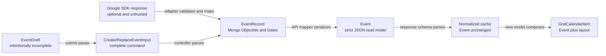
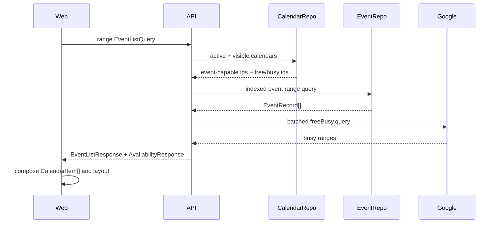

# 01b — Contract examples and boundary flows

This document shows how the schemas in `01a-proposed-contract-schemas.md` look
as data and how one value changes at each application boundary. Values are
illustrative; ObjectIds and timestamps are intentionally fake.

## One concept, separate boundary shapes



The important rule is that arrows are explicit mappers. No layer casts its own
shape into the next layer.

## Calendar examples

### Writable Google calendar returned to the web

```json
{
  "id": "64b000000000000000000101",
  "name": "Work",
  "description": "Company schedule",
  "timeZone": "America/Denver",
  "foregroundColor": "#ffffff",
  "backgroundColor": "#5b6cff",
  "provider": "google",
  "access": "writer",
  "capabilities": {
    "canReadAvailability": true,
    "canReadDetails": true,
    "canWrite": true,
    "canManage": false,
    "canWatchEvents": true
  },
  "isPrimary": false,
  "isVisible": true,
  "isActive": true
}
```

### Free/busy-only calendar returned to the web

```json
{
  "id": "64b000000000000000000102",
  "name": "Leadership",
  "description": "",
  "timeZone": "America/New_York",
  "foregroundColor": "#ffffff",
  "backgroundColor": "#795548",
  "provider": "google",
  "access": "freeBusyReader",
  "capabilities": {
    "canReadAvailability": true,
    "canReadDetails": false,
    "canWrite": false,
    "canManage": false,
    "canWatchEvents": false
  },
  "isPrimary": false,
  "isVisible": true,
  "isActive": true
}
```

This calendar produces `BusyPeriod` values for visible ranges. It never owns
Compass `Event` records or an Events watch.

## Canonical event examples

### Timed standalone event

```json
{
  "id": "64b000000000000000000201",
  "calendarId": "64b000000000000000000101",
  "content": {
    "kind": "details",
    "title": "Design review",
    "description": "Review the v1 contract"
  },
  "schedule": {
    "kind": "timed",
    "start": "2026-07-14T09:00:00-06:00",
    "end": "2026-07-14T10:00:00-06:00",
    "timeZone": "America/Denver"
  },
  "recurrence": { "kind": "single" },
  "priority": "work",
  "createdAt": "2026-07-10T18:00:00Z",
  "updatedAt": null
}
```

No caller checks for missing dates, title, recurrence, priority, calendar, or
id. It narrows only when behavior genuinely differs:

```ts
if (event.schedule.kind === "timed") {
  renderTimedEvent(event.schedule.start, event.schedule.end);
}
```

### Multi-day all-day event

```json
{
  "id": "64b000000000000000000202",
  "calendarId": "64b000000000000000000101",
  "content": {
    "kind": "details",
    "title": "Company retreat",
    "description": ""
  },
  "schedule": {
    "kind": "allDay",
    "start": "2026-08-03",
    "end": "2026-08-06"
  },
  "recurrence": { "kind": "single" },
  "priority": "work",
  "createdAt": "2026-07-10T18:00:00Z",
  "updatedAt": null
}
```

The event covers August 3, 4, and 5. The exclusive end remains a date-only
value in MongoDB, HTTP, IndexedDB, and Google mapping.

### Someday recurring series

```json
{
  "id": "64b000000000000000000203",
  "calendarId": "64b000000000000000000001",
  "content": {
    "kind": "details",
    "title": "Plan next week",
    "description": ""
  },
  "schedule": {
    "kind": "someday",
    "period": "week",
    "anchorDate": "2026-07-13",
    "sortOrder": 2
  },
  "recurrence": {
    "kind": "series",
    "rules": ["RRULE:FREQ=WEEKLY;COUNT=12;BYDAY=SU"]
  },
  "priority": "self",
  "createdAt": "2026-07-10T18:00:00Z",
  "updatedAt": null
}
```

Someday is a schedule, not a second event entity. It therefore retains the same
content, priority, recurrence, undo, and cache behavior.

### Private event visible to a reader

```json
{
  "id": "64b000000000000000000204",
  "calendarId": "64b000000000000000000103",
  "content": { "kind": "busy" },
  "schedule": {
    "kind": "timed",
    "start": "2026-07-14T13:00:00-06:00",
    "end": "2026-07-14T14:00:00-06:00",
    "timeZone": "America/Denver"
  },
  "recurrence": { "kind": "single" },
  "priority": "unassigned",
  "createdAt": "2026-07-10T18:00:00Z",
  "updatedAt": null
}
```

The Google Events resource supplied a stable event identity but withheld its
content. Compass persists an explicit `busy` branch, displays a localized Busy
label, and exposes no mutation controls.

### Free/busy availability period—not an event

```json
{
  "calendarId": "64b000000000000000000102",
  "start": "2026-07-14T15:00:00-06:00",
  "end": "2026-07-14T16:30:00-06:00"
}
```

This value has no event id, content, priority, recurrence, timestamps, or
provider identity because Google free/busy data provides none of those.

## Recurrence examples

```ts
const single = { kind: "single" } as const;

const series = {
  kind: "series",
  rules: ["RRULE:FREQ=WEEKLY;COUNT=12;BYDAY=MO"],
} as const;

const occurrence = {
  kind: "occurrence",
  seriesId: "64b000000000000000000205",
} as const;
```

Impossible legacy states disappear:

| Legacy shape                     | New result                                |
| -------------------------------- | ----------------------------------------- |
| `recurrence: undefined`          | `{ kind: "single" }`                      |
| `recurrence: { rule: [...] }`    | `{ kind: "series", rules: [...] }`        |
| `recurrence: { eventId: "..." }` | `{ kind: "occurrence", seriesId: "..." }` |
| both `rule` and `eventId`        | Migration preflight failure               |
| empty recurrence object          | Migration preflight failure               |

## Create flow

### 1. New web draft

```ts
const draft: NewEventDraft = {
  mode: "create",
  values: {
    title: "Design review",
    description: "",
    calendarId: null,
    schedule: {
      kind: "timed",
      start: null,
      end: null,
      timeZone: "America/Denver",
    },
    recurrence: { kind: "single" },
    priority: null,
  },
  isDirty: false,
  submitError: null,
};
```

Only the draft contains incomplete values. Form components can edit it, but API
and cache functions do not accept `EventDraft`.

### 2. Validated create command

```json
{
  "calendarId": "64b000000000000000000101",
  "content": {
    "kind": "details",
    "title": "Design review",
    "description": ""
  },
  "schedule": {
    "kind": "timed",
    "start": "2026-07-14T09:00:00-06:00",
    "end": "2026-07-14T10:00:00-06:00",
    "timeZone": "America/Denver"
  },
  "recurrence": { "kind": "single" },
  "priority": "work"
}
```

The command cannot claim a user, id, timestamp, origin, Google event id, or
recurrence occurrence.

### 3. Mongo event record

Illustrative extended JSON:

```json
{
  "_id": { "$oid": "64b000000000000000000201" },
  "calendarId": { "$oid": "64b000000000000000000101" },
  "content": {
    "kind": "details",
    "title": "Design review",
    "description": ""
  },
  "schedule": {
    "kind": "timed",
    "start": { "$date": "2026-07-14T15:00:00.000Z" },
    "end": { "$date": "2026-07-14T16:00:00.000Z" },
    "timeZone": "America/Denver"
  },
  "recurrence": { "kind": "single" },
  "priority": "work",
  "externalReference": {
    "provider": "google",
    "eventId": "google-event-123",
    "recurringEventId": null
  },
  "createdAt": { "$date": "2026-07-10T18:00:00.000Z" },
  "updatedAt": null
}
```

The Google reference is added only after provider creation succeeds. It never
returns in the HTTP `Event`.

## Replace flow

```json
{
  "content": {
    "kind": "details",
    "title": "Updated design review",
    "description": "Bring migration notes"
  },
  "schedule": {
    "kind": "timed",
    "start": "2026-07-14T09:30:00-06:00",
    "end": "2026-07-14T10:30:00-06:00",
    "timeZone": "America/Denver"
  },
  "recurrence": { "kind": "preserve" },
  "priority": "work",
  "scope": "this"
}
```

`calendarId` is deliberately absent. The backend loads the existing event,
resolves its owning calendar, verifies `canWrite`, and replaces the editable
snapshot. There is no ambiguous “omitted means unchanged or clear” behavior.

## Transition flow

Dragging a someday event onto the grid submits the explicit transition (A24)
instead of a replace:

```json
{
  "kind": "schedule",
  "targetCalendarId": "64b000000000000000000101",
  "schedule": {
    "kind": "timed",
    "start": "2026-07-14T09:00:00-06:00",
    "end": "2026-07-14T10:00:00-06:00",
    "timeZone": "America/Denver"
  }
}
```

The backend verifies the target calendar is writable, moves the event, and
creates the provider copy. Dragging a scheduled event into the sidebar submits
`{ "kind": "unschedule", "schedule": { "kind": "someday", ... } }`, which moves
the event to the Compass-local calendar and deletes any provider copy. No other
command changes an event's calendar.

## Reorder flow

```json
{
  "period": "week",
  "items": [
    { "eventId": "64b000000000000000000203", "sortOrder": 0 },
    { "eventId": "64b000000000000000000206", "sortOrder": 1 },
    { "eventId": "64b000000000000000000207", "sortOrder": 2 }
  ]
}
```

The reorder service verifies every id is a someday event in the requested
period and owned by the authenticated user, then writes the normalized positions
in one bulk operation. Timed and all-day events cannot enter this command.

## Range read flow



Keeping `EventListResponse` and `AvailabilityResponse` separate prevents busy
ranges from pretending to be persisted events. The web may fetch them in
parallel and combine them only in the view model.

## Cache and layout examples

### Normalized event cache

```ts
const cached: NormalizedEvents = {
  ids: [event.id],
  entities: { [event.id]: event },
};
```

The cached value is the canonical `Event`; there is no `Schema_WebEvent` copy.

### Grid composition

```ts
const gridItem: GridCalendarItem = {
  item: { kind: "event", event },
  layout: {
    top: 540,
    left: 0,
    width: 50,
    height: 60,
    zIndex: 2,
    isOverlapping: true,
    dragOffset: { x: 0, y: 0 },
  },
};
```

Changing layout never mutates or widens `Event`.

## SSE examples

### One known event changed

```json
{
  "type": "eventsChanged",
  "calendarId": "64b000000000000000000101",
  "eventIds": ["64b000000000000000000201"],
  "reason": "updated"
}
```

The web invalidates only queries containing that calendar/range.

### Calendar reconciliation requires a scoped refresh

```json
{
  "type": "eventsChanged",
  "calendarId": "64b000000000000000000101",
  "eventIds": [],
  "reason": "reconciled"
}
```

An empty `eventIds` list means invalidate that calendar, never every user
query.

### Calendar list changed

```json
{
  "type": "calendarsChanged",
  "calendarIds": ["64b000000000000000000101", "64b000000000000000000102"]
}
```

### Sync needs attention

```json
{
  "type": "syncStatusChanged",
  "sync": {
    "status": "attention",
    "code": "WATCH_REPAIR_FAILED",
    "retryable": true
  }
}
```

### Import finished with counts

```json
{
  "type": "importCompleted",
  "operation": "full",
  "eventsCount": 412,
  "calendarsCount": 5
}
```

Every backend publish site emits a `ServerMessage` member (A27); the legacy
`IMPORT_GCAL_*`, `GOOGLE_REVOKED`, and `USER_METADATA` names map into the union
or are retired with their consumers updated in the same release.

## IndexedDB example

```json
{
  "version": 2,
  "id": "64b000000000000000000201",
  "event": {
    "id": "64b000000000000000000201",
    "calendarId": "64b000000000000000000001",
    "content": {
      "kind": "details",
      "title": "Offline note",
      "description": ""
    },
    "schedule": {
      "kind": "someday",
      "period": "week",
      "anchorDate": "2026-07-13",
      "sortOrder": 0
    },
    "recurrence": { "kind": "single" },
    "priority": "unassigned",
    "createdAt": "2026-07-10T18:00:00Z",
    "updatedAt": null
  },
  "isDemo": false
}
```

Offline events belong to the local Compass calendar. Connecting Google does not
silently move them.

## Validation examples

These values must fail at their first boundary:

```ts
// Timed schedule missing an end.
const missingTimedEnd = {
  kind: "timed",
  start: "2026-07-14T09:00:00-06:00",
};

// All-day schedule using an instant instead of a date.
const instantAllDay = {
  kind: "allDay",
  start: "2026-07-14T00:00:00Z",
  end: "2026-07-15T00:00:00Z",
};

// Someday schedule without its user-controlled order.
const missingSomedayOrder = {
  kind: "someday",
  period: "week",
  anchorDate: "2026-07-13",
};

// Recurrence with mutually exclusive identities.
const conflictingRecurrence = {
  kind: "series",
  rules: [],
  seriesId: "64b000000000000000000205",
};

// Client claims a Google provider identity.
const forgedProviderIdentity = {
  calendarId: "64b000000000000000000101",
  externalReference: { provider: "google", eventId: "forged" },
};

// Existing event tries to move calendars through replace.
const crossCalendarReplace = {
  calendarId: "64b000000000000000000999",
  scope: "this",
};
```

Strict schemas reject unknown keys as well as missing required keys.

## Mapper ownership

| Mapper                   | Input                               | Output                                 | Owner                   |
| ------------------------ | ----------------------------------- | -------------------------------------- | ----------------------- |
| `mapGoogleCalendar`      | Google CalendarList entry           | `CalendarRecord`                       | Google calendar adapter |
| `mapCalendarRecord`      | `CalendarRecord`                    | `Calendar`                             | Calendar API mapper     |
| `mapGoogleEvent`         | Google Event                        | `GoogleEventMapResult`                 | Google event adapter    |
| `mapEventRecord`         | `EventRecord`                       | `Event`                                | Event API mapper        |
| `mapCreateInput`         | `CreateEventInput` + server context | `EventRecord`                          | Event service           |
| `mapEventRecordToGoogle` | `EventRecord` + calendar source     | Google write input                     | Google event adapter    |
| `parseEventDraft`        | `EventDraft`                        | create/replace command or field errors | Web form boundary       |
| `normalizeEvents`        | `Event[]`                           | `NormalizedEvents`                     | Web query layer         |
| `layoutCalendarItems`    | `CalendarItem[]`                    | `GridCalendarItem[]`                   | Web view model          |
| `migrateLocalEvent`      | legacy IndexedDB value              | `LocalEventRecord`                     | Web storage migration   |

Each mapper has one direction and one owner. Round-trip tests cover only pairs
where information is intentionally preserved.

## Interaction summary

```text
Calendar
├── determines ownership, provider, visibility, and capabilities
├── owns many Event records when Events access exists
└── produces BusyPeriod reads when access is freeBusyReader

Event
├── has exactly one EventContent variant
├── has exactly one EventSchedule variant
├── has exactly one EventRecurrence variant
└── never contains user, provider, form, cache, or layout state

EventRecord
├── adds Mongo identities and dates
├── adds at most one external provider reference (null = never synced)
└── maps to Event at the HTTP boundary

EventDraft
├── is the only incomplete event-like structure
├── converts to one strict command before network/cache use
└── cannot move an existing event to another calendar
    (the schedule transition command is the single exception)
```
